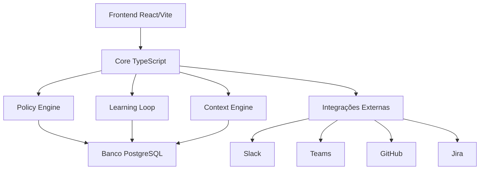

# Documentação do Adaptive Governance Framework

## Arquitetura e Fluxos



## Fluxos Principais

### 1. Fluxo de Política Adaptativa
1. Sistema recebe métricas (ex: performance, segurança)
2. Context Engine analisa o contexto atual
3. Policy Engine aplica políticas relevantes
4. Learning Loop refina políticas com base em resultados
5. Integrações notificam times relevantes

### 2. Fluxo de Aprendizado
1. Incidente ou métrica fora do padrão é detectado
2. Sistema coleta feedback e contexto
3. Learning Loop ajusta políticas
4. Novas políticas são validadas e aplicadas
5. Resultados são monitorados

## Exemplos de Uso Real

### Caso 1: Governança de Performance
```typescript
// Política de performance
const perfPolicy = {
  slo: {
    latency_p95_ms: 200,
    availability: 99.9
  },
  actions: {
    if_violated: ['notify_team', 'scale_resources']
  }
};

// Uso no Learning Loop
const learningLoop = new LearningLoop([
  { type: 'latency', value: 250 }, // Violação
  { type: 'availability', value: 99.95 } // OK
]);

const refinedPolicy = learningLoop.refinePolicies({ performance: perfPolicy });
```

### Caso 2: Governança de Segurança
```typescript
// Política de segurança
const securityPolicy = {
  rules: {
    max_critical_vulnerabilities: 0,
    max_high_vulnerabilities: 2
  },
  actions: {
    if_violated: ['block_deploy', 'notify_security']
  }
};

// Uso no Context Engine
const contextEngine = new ContextEngine({
  environment: 'production',
  policies: { security: securityPolicy }
});

const decision = contextEngine.evaluateDeployment({
  vulnerabilities: {
    critical: 1,
    high: 1
  }
});
```

## Como Contribuir

1. **Bugs e Sugestões**
   - Abra uma issue detalhando o problema/sugestão
   - Use os templates disponíveis em `.github/ISSUE_TEMPLATE`
   - Inclua logs, screenshots e passos para reproduzir

2. **Pull Requests**
   - Fork o repositório
   - Crie uma branch: `git checkout -b feature/sua-feature`
   - Faça commits seguindo [Conventional Commits](https://www.conventionalcommits.org/)
   - Abra o PR usando o template em `.github/PULL_REQUEST_TEMPLATE`

3. **Desenvolvimento Local**
   ```sh
   # Clone e instale
   git clone https://github.com/carlospiquet2023/adaptive-governance-framework.git
   cd adaptive-governance-framework
   
   # Core
   cd core
   npm install
   npm run dev
   
   # UI
   cd ../ui
   npm install
   npm run dev
   ```

## Roadmap 2025-2026

### Q3 2025
- [x] MVP com core funcional
- [x] UI básica e integrações
- [x] Documentação inicial

### Q4 2025
- [ ] Autenticação JWT real
- [ ] Mais integrações (Azure DevOps, GitLab)
- [ ] Dashboard avançado

### Q1 2026
- [ ] Machine Learning no Learning Loop
- [ ] Plugins customizados
- [ ] API pública documentada

### Q2 2026
- [ ] Marketplace de políticas
- [ ] Análise preditiva
- [ ] Alta disponibilidade
